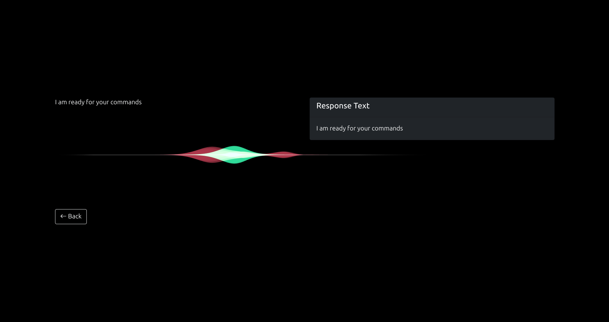

# Jarvis AI Assistant


A sophisticated voice-controlled personal assistant with facial recognition security and modern web interface.

[](LICENSE)
[](https://www.python.org/downloads/)
[](https://github.com/yourusername/jarvis)

> **Note**: This project is actively developed with weekly feature updates and improvements.

<div class="showcase">
  
  
  
</div>

## 📋 Features

- **Secure Facial Authentication**
  - Personalized user recognition
  - Multiple user profiles support
  - Secure login system
  - Privacy-focused with local processing

- **Advanced Voice Command System**
  - Natural language processing
  - Customizable command library
  - Contextual responses
  - Multilingual support

- **Intelligent Hotword Activation**
  - Responds to "Jarvis" wake word
  - Configurable sensitivity
  - Background noise filtering

- **Elegant Web Interface**
  - Modern responsive design
  - Real-time visual feedback
  - Chat history and interaction logging
  - Dark/light theme options

- **System Automation**
  - Control compatible smart home devices
  - Schedule tasks and reminders
  - File and web search capabilities
  - Calendar integration

## 🖥️ System Requirements

- **Hardware**:
  - Webcam (720p+ recommended)
  - Microphone
  - Speakers/Headphones
  - 4GB+ RAM recommended
  - 500MB free disk space

- **Software**:
  - Python 3.6 or higher
  - Modern web browser (Chrome/Firefox recommended)
  - OpenCV with face recognition support
  - Internet connection for web searches and updates

## 🌐 Platform Compatibility

| Platform | Status | Notes |
|----------|--------|-------|
| Linux    | ✅ Full support | Thoroughly tested on Ubuntu 20.04+ and Debian 10+ |
| Windows  | ⚠️ Partial support | Works on Windows 10/11, may require camera configuration adjustments |
| macOS    | ⚠️ Limited testing | Basic functionality works on macOS 11+ (Big Sur) |

> **Note**: Currently primarily tested and optimized for Linux environments. Cross-platform improvements are ongoing.

## 📥 Installation

### Prerequisites

Ensure you have Python 3.6+ and pip installed:

```bash
python --version
pip --version
```

### Step 1: Clone the repository

```bash
git clone https://github.com/yourusername/jarvis.git
cd jarvis
```

### Step 2: Install dependencies

**For Linux:**
```bash
bash install.sh
```

**For Windows:**
```bash
pip install -r requirements-windows.txt
```

**For macOS:**
```bash
pip install -r requirements-mac.txt
```

### Step 3: Configure environment

Create a `.env` file in the root directory:

```
# API Keys
OPENAI_API_KEY=your_openai_key_here
WEATHER_API_KEY=your_weather_api_key_here

# Configuration
DEBUG_MODE=False
LOG_LEVEL=INFO
CAMERA_INDEX=0
MIC_INDEX=0
```

## 🔐 Facial Recognition Setup

### Step 1: Capture Face Samples

```bash
python backend/auth/sample.py
```

During this process:
- You'll be prompted for a numeric user ID
- Enter your name when prompted or add it to the names list
- The script will capture 100 images of your face
- Look at the camera from different angles for better recognition
- Press ESC to exit early if needed

### Step 2: Train the Recognition Model

```bash
python backend/auth/trainer.py
```

This will:
- Process your face samples
- Create a trainer.yml file
- Save the model in the trainer directory
- Optimize recognition parameters for your hardware

## 🚀 Running the Application

Start the main application:

```bash
python app.py
```

The application will:
1. Initialize all services
2. Open a browser window with the Jarvis UI
3. Perform facial authentication
4. If authenticated, display the main interface
5. Begin listening for the "Jarvis" hotword
6. Process commands through voice or text input

## 💬 Voice Commands

Example commands you can use:
- "Jarvis, what's the weather today?"
- "Jarvis, set a timer for 5 minutes"
- "Jarvis, play some music"
- "Jarvis, search for Python tutorials"
- "Jarvis, tell me a joke"
- "Jarvis, turn on the living room lights"
- "Jarvis, what's on my calendar today?"
- "Jarvis, send an email to John"

## 🔧 Troubleshooting

### Face Recognition Issues

If face authentication isn't working:

```bash
# Verify the trainer file exists
ls -l backend/auth/trainer/trainer.yml

# Rebuild your training data in better lighting
python backend/auth/sample.py
python backend/auth/trainer.py

# Test recognition separately
python backend/auth/test_recognition.py
```

### Camera Problems

If the camera doesn't work:

```bash
# Check camera permissions on Linux
ls -l /dev/video*

# Ensure no other application is using the camera
sudo fuser -v /dev/video0

# Try different camera indices in your .env file
CAMERA_INDEX=1
```

The application tries multiple camera backends:
- `cv2.CAP_ANY`
- `cv2.CAP_V4L`
- `cv2.CAP_V4L2`
- `cv2.CAP_DSHOW` (Windows)
- `cv2.CAP_AVFOUNDATION` (macOS)

### Audio Issues

If voice recognition isn't working:

```bash
# Check audio input devices
python -c "import pyaudio; p = pyaudio.PyAudio(); [print(p.get_device_info_by_index(i)) for i in range(p.get_device_count())]"

# Test microphone
python backend/tests/test_audio.py

# Try different microphone indices in your .env file
MIC_INDEX=1
```

## 🧠 Developer Notes

### Project Structure

```
jarvis/
├── app.py                 # Main application entry point
├── backend/
│   ├── auth/              # Authentication modules
│   │   ├── sample.py      # Captures face samples
│   │   ├── trainer.py     # Creates face recognition model
│   │   └── recognize.py   # Authenticates users
│   ├── command.py         # Command processing
│   ├── feature.py         # Core assistant features
│   ├── nlp/               # Natural language processing
│   │   ├── intent.py      # Intent recognition
│   │   └── entity.py      # Entity extraction
│   └── utils/             # Utility functions
│       ├── audio.py       # Audio processing
│       ├── camera.py      # Camera handling
│       └── network.py     # Network operations
├── frontend/              # Web interface files
│   ├── index.html         # Main UI
│   ├── styles/            # CSS files
│   │   ├── main.css       # Main stylesheet
│   │   └── themes/        # Theme variations
│   ├── scripts/           # JavaScript files
│   │   ├── main.js        # Core functionality
│   │   ├── voice.js       # Voice processing
│   │   └── ui.js          # UI interactions
│   └── assets/            # Images, icons, etc.
│       ├── img/           # Images
│       ├── icons/         # UI icons
│       └── sounds/        # Audio cues
├── data/                  # Data storage
│   ├── faces/             # Face samples
│   ├── users/             # User profiles
│   └── logs/              # Application logs
└── tests/                 # Test modules
    ├── test_auth.py       # Authentication tests
    ├── test_commands.py   # Command tests
    └── test_features.py   # Feature tests
```

### Adding Features

To add new commands:

1. Update the `process_command` function in `app.py`:
```python
def process_command(command):
    # ... existing code ...
    elif "your new command" in command:
        return your_new_function()
    # ... existing code ...
```

2. Add new functions in the `feature.py` file:
```python
def your_new_function():
    # Implementation
    return "Response to the user"
```

3. Add tests for your new feature:
```python
# tests/test_features.py
def test_your_new_function():
    result = your_new_function()
    assert result == "Expected response"
```

## 📊 Performance Optimization

For better performance on resource-constrained systems:

```bash
# Run in lightweight mode
python app.py --lightweight

# Disable unnecessary features
python app.py --no-gui  # Terminal mode
python app.py --no-hotword  # Disable always-listening mode
```

## 🔄 Updates and Maintenance

To update Jarvis to the latest version:

```bash
git pull origin main
pip install -r requirements.txt
python migrate.py  # Apply any database migrations
```

## 🤝 Contributing

Contributions are welcome! Here's how you can help:

1. Fork the repository
2. Create a feature branch:
   ```bash
   git checkout -b feature/amazing-feature
   ```
3. Commit your changes:
   ```bash
   git commit -m 'Add some amazing feature'
   ```
4. Push to the branch:
   ```bash
   git push origin feature/amazing-feature
   ```
5. Open a Pull Request

Please ensure your code follows the project's coding style and includes appropriate tests.

## 📝 License

This project is licensed under the MIT License - see the [LICENSE](LICENSE) file for details.

## 🙏 Acknowledgments

- Thanks in advance to all contributors and testers
- Special thanks to the OpenCV and Python communities
- All the open-source libraries that made this project possible

## 🔮 Roadmap (Maybe in future)

- [ ] Mobile application support
- [ ] Cloud sync for user preferences
- [ ] Advanced NLP for more natural conversations
- [ ] Integration with additional smart home platforms
- [ ] Offline mode for privacy-focused users
